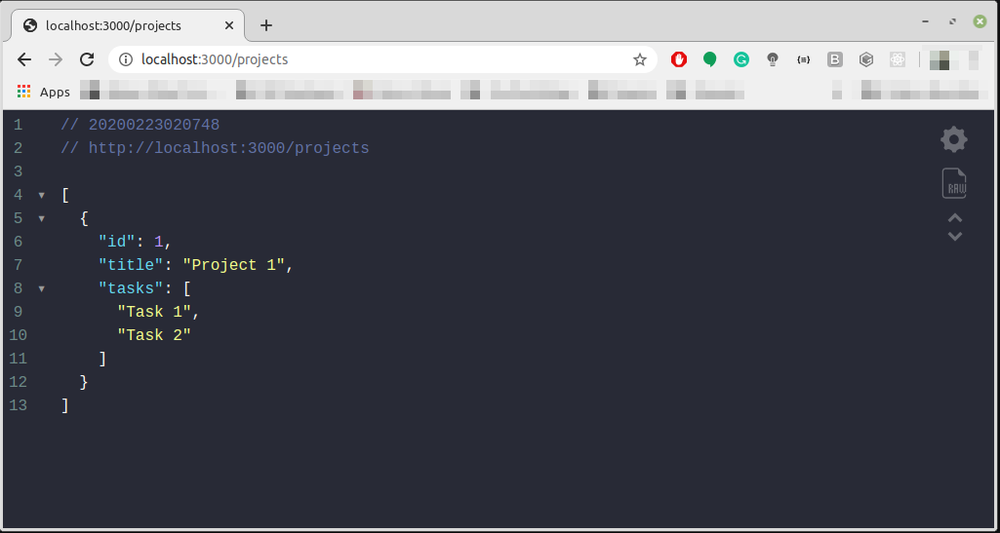

# NodeJS: 1º Proof of Concept

A short NodeJS application for testing some development concepts such as http requests using express and the use of middlewares for entry validation

## Getting Started

These instructions will get you a copy of the project up and running on your local machine for development and testing purposes. For being a proof of concept, there's no deployment state for this project. You can also run this project with **Gitpod**, just clicking on the button on top of this repository. To know more about **Gitpod**, just click [here](https://www.gitpod.io/).

### Prerequisites

You just need to have a **Node** version installed on your machine. In the case you don't have one, follow these [instructions](https://nodejs.org/en/download/package-manager/).

This application don't have a graphic interface, so you will need a tool for making the requests. There's many tools on the Internet, but I like these one: **Insomnia** and you can learn how to install it [here](https://insomnia.rest/download/) 

### Installing

With **Node** installed on your machine, clone this repository and then run this command on terminal inside the root project:

```shell
yarn install & yarn dev
```

If you don't see any errors in the execution of the command above, open a browser and type this url: `http://localhost:3000/projects`. You should see something like this:



If you like this kinda JSON presentation on the browser (In the case, Google Chrome), use the extension **JSON Viewer**. You can find it [here](https://chrome.google.com/webstore/detail/json-viewer/gbmdgpbipfallnflgajpaliibnhdgobh?hl=pt-BR) 

## Working with the Application

The operation of this application is very simple. We have five routes and you can manipulate data of an excuting time array, using the **non-blocking IO** concept from **Node**. If you want to know more about this concept, click [here](https://nodejs.org/en/docs/guides/blocking-vs-non-blocking/)

### The Routes

The application have five routes that implements a **CRUD** (Create-Read-Update-Delete) for projects, a fake form with some simple data: id, title and a list of tasks. Below, there are a short description of each route.


- **[GET] /projects :** This route list all the projects saved on the server. For default, it begins with one project and the return is a list like this:

```json
[
  {
    id: 1,
    title: "Project 1",
    tasks: [
      "task 1",
      "task 2"
    ]
  }
]
```

- **[POST] /projects :** This route insert a new project on the server and demands 2 entrys: the **id** and the **title** of the project. The data is send to the server in a JSON format, like below:

```json
{
  "id": 1,
  "title": "Project 2"
}
```

- **[POST] /projects/:id/tasks :** This route insert a new task in some project and demands 2 entrys: the **id** (using query params) and the **title** (use request body) of the project. The title is send to the server in a JSON format, like below:

```json
{
  "title": "Some Task To Do"
}
```

- **[PUT] /projects/:id :** This route edit a specific project, but only the title. It demands 2 entrys: the **id** (using query params) and the new **title** for the project. The title data is send to the server in a JSON format, like below:

```json
{
  "title": "New Project title"
}
```

- **[DELETE] /projects:id :** This route deletes a specific project. It demands a entry: the **id** (using query params):

### The Middlewares

By definition, **middleware** is a software that serves common resources to multiple applications. Using the same principle, we have some functions that serves common resources to multiple requests, such as logging and validation. This project have 3 middlewares: **countRequest**, **checkExistingProject** and **checkPostEntrys**.

- The middleware **countRequests()** log the application printing some data about the request, besides the number of requests made so far to the server. It prints something like this:

```shell
1 requests so far
method: GET; URL: /projects
Request time: 6.112ms
```

- The middleware **checkExistingProject()** checks if a project exists on the server based on the id parameter passed from client. If everything is OK, the execution go on, but if is not, a message with http 400 status code will be returned like this:

```json
{
  error: "Project not found"
}
```

- The middleware **checkPostEntrys()** checks if the entrys of a request matches with is expected from the request url. If everything is OK, the execution go on, but if is not, a message with http 400 status code will be returned like this:

```json
{
  error: "Parameters missing"
}
```

## Built With

* [NodeJS](https://nodejs.org/en/about/) - The interpreter used
* [Express](http://expressjs.com/) - The framework used

## Author

* **Tom Benevides** - *Like a A barber in Seville* ([Dev.to](https://dev.to/tombenevides) - [Instagram](https://instagram.com/tombenevides3))

## License

This project is licensed under the MIT License - see the [LICENSE](LICENSE.md) file for details